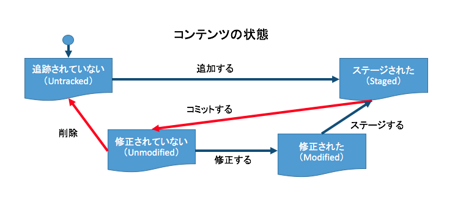

# git超入門

初めてgitを触った時のメモ

## とりあえずすること

```
mkdir hoge && cd hoge
git init
git remote add origin https://github.com/yukimaru77/リポジトリ名.git
```
ちなみに`git remote add origin …`のoriginはurlに別名をつけている。なので今後originと出てきたらこのリモートリポジトリを指しているんだなと思えばいい。
## git add

```
git add [オプション] ファイル名やディレクトリ名
```
git addコマンドはステージングを行う。一見必要ないように思えるが、これがないと記録を保存したくないものまで保存してしまう。変更を記録したいものだけgit addを行ってインデックスに追加する(ステージング)
<details open>
<summary>オプション一覧</summary>
<dl>
  <dt>-A(--all)</dt>
  <dd>すべてのファイルをインデックスに追加。削除したファイルは削除したことも登録</dd>
  <dt>*(ワイルドカード)</dt>
  <dd>すべてに一致するため、例えば<code>git add *.html images/*.png</code>とすれば、「*.html」と「images/*.png」をインデックスに追加する</dd>
  <dt>-u(--update)</dt>
  <dd>現在gitで管理しているすべてのファイルの変更内容をステージング(真ファイルは追加されない)</dd>
  <dt>-f</dt>
  <dd>.gitignoreで対象外としているファイルもインデックスに追加する</dd>
</dl>
</details>

## git commit

```
git commit -m "コメント"
git commit ファイル名やディレクトリ名 -m "コメント"
```
`git commit -m "コメント"`に関してはインデックス領域にステージングされた変更内容をすべてまとめてコミットする。

`git commit ファイル名やディレクトリ名 -m "コメント"`に関しては指定したファイルのステージングとコミットを一括で可能。

## git push、git pull

```
git push origin 'ブランチ名'
git pull origin 'ブランチ名'
```
前提として`git remote add origin リモートリポジトリのURL`とする。よって、originはリモートリポジトリを指し'ブランチ名'はリモートリポジトリのブランチ名を指す。

`git push origin 'ブランチ名'`は**今いるブランチの変更をoriginが指すリモートリポジトリの'ブランチ名'にpushする**という意味。

pullも同様に、**originが指すリモートリポジトリの'ブランチ名'の変更を今いるブランチにpullする**という意味。

## git status

```
git status
```

git statusはワーキング・ツリーの状態を見るためのコマンドである。ワーキングツリー
の状態は以下の状態で表せられる。

画像は[こちら](https://eng-entrance.com/git-status)よりお借りしました。

<dl>
  <dt>Untracked Files:</dt>
  <dd>追跡されていないファイル。つまりステージングされていないファイルを指す。なお、gitはコミットした後も**追跡状態(tracked)**となり、修正されたか監視している。ただし、変更を記録したい場合はやはり同様にステージングしなければならない。<strong>追跡されていないファイルも一度コミットしたファイルもステージングしなければいけないのは同じだが状態は異なる</strong>(追跡されているか否か)</dd>
  <dt>Changes to be committed</dt>
  <dd>コミットされるべき変更。つまり**ステージングされたファイル(staged)**を指す。</dd>
  <dt>nothing to commit, working tree clean</dt>
  <dd>コミットした後の状態。「コミットするものは何もない。ワーキング・ツリーは修正されていない。」**ファイルは修正されていない（Unmodified）**になる。</dd>
  <dt>Modified</dt>
  <dd>コミットされて追跡状態になっているファイル(Unmodified)が修正されると、**Modified状態**になる。読めば分かるが、修正された後にステージングされていない場合は赤字、ステージングはされている場合は緑字で表示される。</dd>
  <dt>deleted</dt>
  <dd>コミットされて追跡状態になっているファイル(Unmodified)が削除されると、**deleted状態**になる。次のコミットでこの削除がリポジトリに反映される。</dd>
</dl>